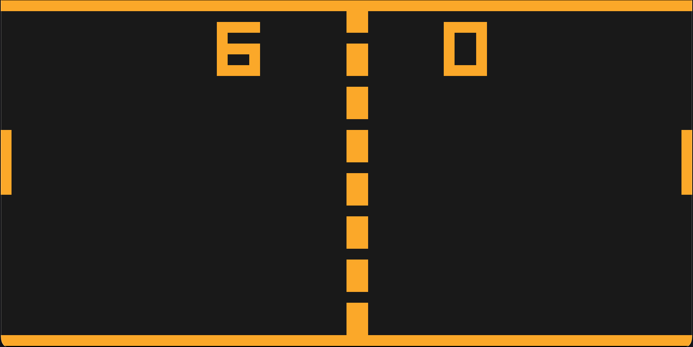

# CHIP-8

A CHIP-8 emulator in Rust.


<p align="center">
  
</p>

## Run

```sh
cargo run --release -- tests/pong.ch8
```

QWERTY maps to the CHIP-8 hex keypad:

```
1 2 3 4       1 2 3 C
Q W E R  ->   4 5 6 D
A S D F       7 8 9 E
Z X C V       A 0 B F
```

## Reference

Built by following [Cowgod's CHIP-8 Technical Reference](http://devernay.free.fr/hacks/chip8/C8TECH10.HTM).
